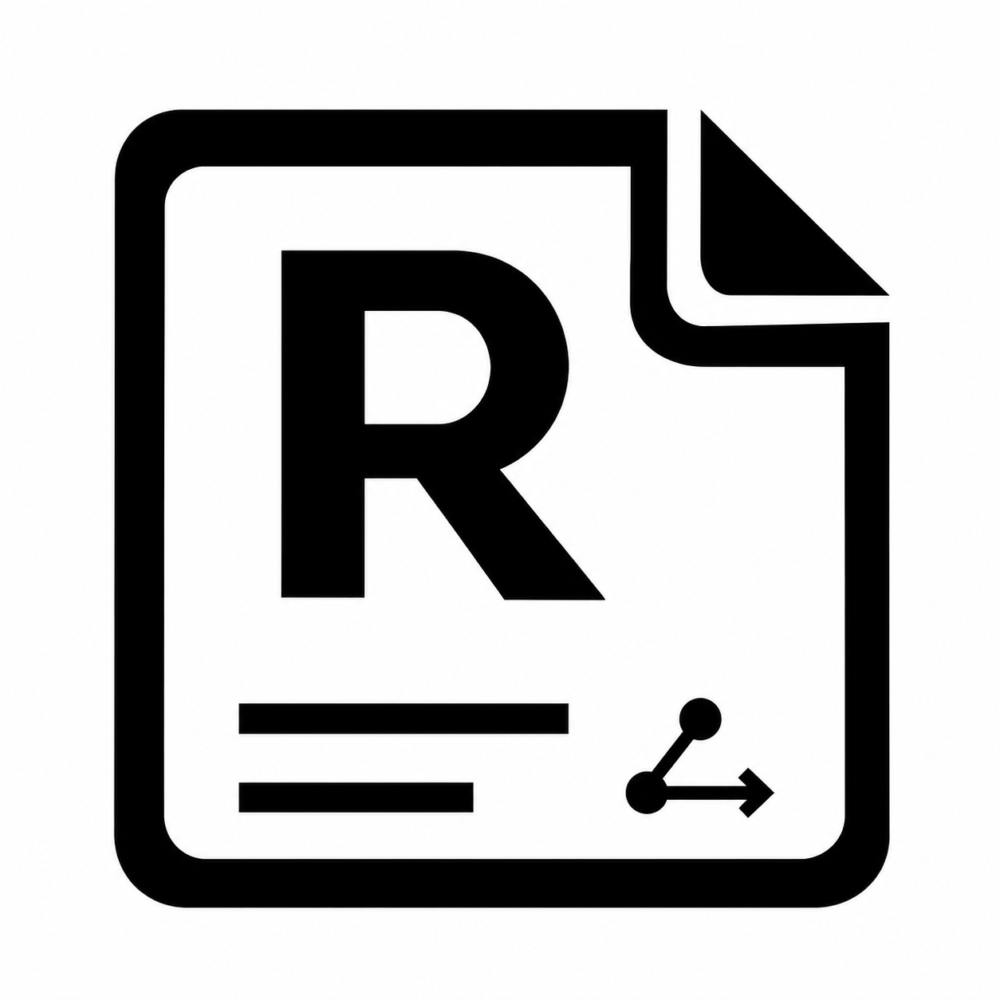

# RetainPDF Relay Proxy



RetainPDF Relay Proxy 是给 RetainPDF 桌面版使用的本地 OpenAI 兼容中转代理。它不会修改 RetainPDF 源码，也不会修改 RetainPDF.exe；工具只是在本机启动一个轻量 HTTP 服务，把 RetainPDF 的模型请求转发到你配置的上游中转站或 OpenAI 兼容接口。

原软件项目：[wxyhgk/retain-pdf](https://github.com/wxyhgk/retain-pdf)

本项目是独立辅助工具，不代表 RetainPDF 官方组件。

## 最小启动要求

直接使用 Release 里的 `RetainPdfRelayProxy.exe` 时，只需要：

- Windows 10/11 x64。
- 一个可用的上游 OpenAI 兼容接口地址，例如 `https://your-relay.example.com/v1`。
- 上游接口的 API Key。
- 本机 `127.0.0.1:18181` 端口未被其他程序占用。
- 如果要让工具自动启动 RetainPDF，需要本机已安装 RetainPDF 桌面版，并在配置窗口中选择 `RetainPDF.exe`。

Release 版 exe 不需要安装 Python。只有从源码运行或自行构建 exe 时才需要 Python。

## 下载后直接运行

在 GitHub Release 页面下载：

```text
RetainPdfRelayProxy.exe
```

建议把 exe 放到一个单独文件夹后双击运行。首次无参数运行时会打开配置窗口；保存配置后，会在 exe 同目录生成：

```text
retainpdf-relay-proxy.json
retainpdf-relay-proxy.log
```

`retainpdf-relay-proxy.json` 保存你的中转站地址、API Key、模型名等本地配置；`retainpdf-relay-proxy.log` 保存运行日志。这两个文件都属于个人本地文件，不应公开上传。

## 配置窗口

配置窗口中填写：

- 中转站网址：上游 OpenAI 兼容接口的 Base URL，例如 `https://your-relay.example.com/v1`。
- API Key：你的上游中转站密钥。
- 模型名：可选；为空时沿用 RetainPDF 请求中的模型。
- RetainPDF.exe：可选；用于“保存并启动”时自动打开 RetainPDF。
- 并发上限：同时转发到上游的最大请求数。
- RPM 限制：每分钟最多请求数，`0` 表示不限制。
- 写入 RetainPDF 隐藏接口配置：适用于桌面端隐藏开发者设置的版本。
- 本地模拟 DeepSeek 余额检查：用于让部分客户端通过提交前检查。

保存并启动后，本地代理会监听：

```text
http://127.0.0.1:18181/v1
```

RetainPDF 兼容入口为：

```text
http://127.0.0.1:18181/api.deepseek.com/v1
```

## RetainPDF 手动设置

如果需要在 RetainPDF 中手动填写开发者设置：

- Base URL：`http://127.0.0.1:18181/api.deepseek.com/v1`
- API Key：任意非空值，或你的真实上游 Key
- Model：你的中转站模型名；如果已在本工具中固定 `upstream_model`，这里保持一致即可

如果使用配置窗口的“保存并启动”，通常不需要手动填写这些项。

## 健康检查

代理启动后可以检查：

```powershell
Invoke-RestMethod http://127.0.0.1:18181/health
Invoke-RestMethod http://127.0.0.1:18181/user/balance
Invoke-RestMethod http://127.0.0.1:18181/api.deepseek.com/v1/models
```

## 从源码运行

从源码运行的最小要求：

- Windows、macOS 或 Linux。
- Python 3.10+。
- 需要 GUI 时，Python 环境需包含 Tkinter。

打开配置窗口：

```powershell
.\Start-RetainPdfRelayProxy.ps1 -Gui
```

也可以双击：

```text
OneClick-Start-RetainPDF-Relay.vbs
```

示例配置可以复制到项目根目录：

```powershell
Copy-Item .\config\retainpdf-relay-proxy.example.json .\retainpdf-relay-proxy.json
```

## 配置字段

`config\retainpdf-relay-proxy.example.json` 包含所有常用字段：

```json
{
  "listen_host": "127.0.0.1",
  "listen_port": 18181,
  "upstream_base_url": "https://your-relay.example.com/v1",
  "upstream_api_key": "sk-your-relay-api-key",
  "upstream_model": "",
  "upstream_transport": "auto",
  "retainpdf_exe_path": "",
  "max_concurrent": 5,
  "max_requests_per_minute": 60,
  "acquire_timeout_seconds": 3600,
  "upstream_timeout_seconds": 180,
  "forward_authorization": true,
  "log_requests": true,
  "patch_desktop_config": true,
  "desktop_config_path": "",
  "retainpdf_api_key": "",
  "mock_balance": true,
  "mock_balance_total": "999.00"
}
```

主要字段含义：

| 字段 | 含义 |
| --- | --- |
| `listen_host` | 本地监听地址，默认只监听 `127.0.0.1`。 |
| `listen_port` | 本地监听端口，默认 `18181`。 |
| `upstream_base_url` | 上游 OpenAI 兼容接口 Base URL。 |
| `upstream_api_key` | 上游 API Key。不要公开提交真实值。 |
| `upstream_model` | 固定上游模型名；为空时沿用 RetainPDF 请求里的模型。 |
| `upstream_transport` | 上游请求方式，建议保持 `auto`。Windows 下会优先使用 `curl.exe`。 |
| `retainpdf_exe_path` | RetainPDF.exe 路径，用于保存配置后自动启动 RetainPDF。 |
| `max_concurrent` | 同时转发到上游的最大请求数。 |
| `max_requests_per_minute` | 每分钟最多请求数，`0` 表示不限制。 |
| `acquire_timeout_seconds` | 排队等待并发或 RPM 名额的最长时间。 |
| `upstream_timeout_seconds` | 上游接口请求超时时间。 |
| `forward_authorization` | 没有固定 `upstream_api_key` 时，是否转发 RetainPDF 请求头里的 Authorization。 |
| `log_requests` | 是否记录请求转发日志。 |
| `patch_desktop_config` | 是否写入 RetainPDF 桌面隐藏配置。 |
| `desktop_config_path` | RetainPDF 桌面配置路径；为空时自动查找常见路径。 |
| `retainpdf_api_key` | 写入 RetainPDF 的本地 API Key；通常留空即可。 |
| `mock_balance` | 是否启用本地余额检查响应。 |
| `mock_balance_total` | 本地模拟余额显示值。 |

## 文件和目录说明

| 路径 | 含义 |
| --- | --- |
| `README.md` | 项目说明文档。 |
| `LICENSE` | MIT 开源许可证。 |
| `.gitignore` | 忽略本地配置、日志、构建产物和发布包。 |
| `Start-RetainPdfRelayProxy.ps1` | PowerShell 启动入口；从源码运行时推荐使用。 |
| `OneClick-Start-RetainPDF-Relay.vbs` | Windows 双击启动入口；优先运行 `dist\RetainPdfRelayProxy.exe`，否则回退到 Python 脚本。 |
| `OneClick-Start-RetainPDF-Relay.bat` | 批处理启动入口，功能与 VBS 类似，便于排查启动问题。 |
| `Build-WindowsExe.ps1` | 根目录构建包装脚本，会调用 `scripts\Build-WindowsExe.ps1`。 |
| `Package-Release.ps1` | 根目录打包包装脚本，会调用 `scripts\Package-Release.ps1`。 |
| `src\retainpdf_relay_proxy.py` | 主程序，包含本地 HTTP 代理、配置读取、GUI、RetainPDF 配置写入和启动逻辑。 |
| `assets\retainpdf-relay-proxy.png` | README 和 Tk GUI 使用的 PNG 图标。 |
| `assets\retainpdf-relay-proxy.ico` | Windows exe 使用的图标。 |
| `assets\RetainPdfRelayProxy.exe.manifest` | Windows exe manifest，用于 DPI 感知等桌面行为。 |
| `config\retainpdf-relay-proxy.example.json` | 示例配置，不包含真实密钥。 |
| `scripts\Build-WindowsExe.ps1` | 实际 PyInstaller 构建脚本。 |
| `scripts\Package-Release.ps1` | 实际发布包生成脚本，使用白名单复制公开文件。 |
| `dist\` | 本地 exe 构建产物，默认不提交。 |
| `release\` | 本地发布包输出目录，默认不提交。 |
| `retainpdf-relay-proxy.json` | 本地真实配置，包含 API Key，默认不提交。 |
| `retainpdf-relay-proxy.log` | 本地运行日志，默认不提交。 |

## 构建 Windows exe

安装 PyInstaller：

```powershell
python -m pip install pyinstaller
```

构建：

```powershell
.\Build-WindowsExe.ps1
```

生成文件：

```text
dist\RetainPdfRelayProxy.exe
```

构建脚本会使用 `assets\retainpdf-relay-proxy.ico` 和 `assets\RetainPdfRelayProxy.exe.manifest`，并把 `assets\` 资源打进 exe。

## 生成发布包

```powershell
.\Package-Release.ps1 -Version 0.1.0 -BuildExe
```

该命令会先构建 exe，再生成：

```text
release\retainpdf-relay-proxy-0.1.0.zip
```

发布包采用白名单复制，只包含公开源码、启动脚本、示例配置、图标、README、许可证和可运行 exe；不会包含本地 `retainpdf-relay-proxy.json`、日志、构建缓存或个人路径。

## 安全提示

- 不要提交 `retainpdf-relay-proxy.json`。
- 不要提交真实 API Key、真实中转站地址、本机软件路径或日志。
- 如果曾误提交 API Key，请立即到上游服务商后台重置密钥。
- 
## 感谢
https://linux.do/
## 开源协议

本项目使用 [MIT License](LICENSE)。
